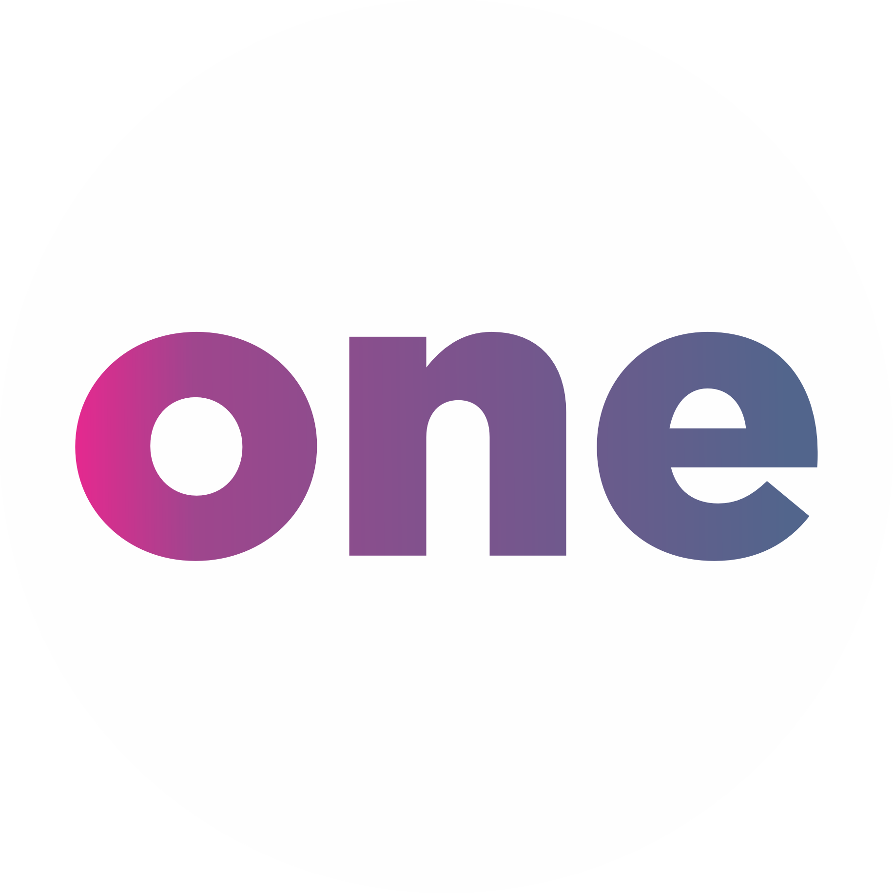

<h1 align="center"> Fromação Front-end - Alura  </h1>

Abaixo estarão todos os projetos que fazem parte da "Formação Front-end" da Platafroma ALURA, apresentados por Guilherme Lima, Rafaella Ballerini e Monica Hillman🚀. 

  <a href="#-tecnologias">Tecnologias</a>&nbsp;&nbsp;&nbsp;|&nbsp;&nbsp;&nbsp;
  <a href="#-projeto">Projeto</a>&nbsp;&nbsp;&nbsp;|&nbsp;&nbsp;&nbsp;
  <a href="#-layout">Layout</a>&nbsp;&nbsp;&nbsp;|&nbsp;&nbsp;&nbsp;
  <a href="#memo-licença">Licença</a>

  

 

<h1 align="center"> Projeto atual em desenvolvimento - Portfolio Alura </h1>
 
  

    
  

 
<h1 align="center">Projeto personalizado - Portfolio Alura </h1>
 
  
   

    
  

 
 

 
🧑‍🚀 A idéia deste projeto foi disponibilizada no curso de formação Front End "A partir do zero: Html, Css para projetos web", contendo 6 módulos e um total de 51 horas apresentado por Guilherme Lima, Rafaella Ballerini e Monica Hillman ❤️‍🔥.

## 🚀 Tecnologias

Esse projeto está sendo desenvolvido com as seguintes tecnologias:

<li> HTML
<li> CSS
<li> Figma
<li> Git and GitHub

## 💻 Projeto

Minha intenção é compartilhar o avanço dos estudos e aprendizado, para que tenha aqui disponível um formato simples, responsivo e otimizado dos projetos para contrução de um portfólio de quem está iniciando em desenvolvimento web como Eu.

 
Fiz um vídeo da pré produção do conteúdo e postei no canal que criei do Youtube para compartilhar o processo de evolução do aprendizado, o nome do canal é 
 

  Para ver o projeto atual em desenvolvimento basta<a href="https://robertojunnior.github.io/alura/portfolio-alura/"> CLICAR AQUI.</a>🚀

## 🔖 Layout
Os projetos no FIGMA foram desenvolvido por ALURA. 
🖼️ Para acessá-los, você precisa criar uma conta no FIGMA, caso já possua basta <a href="https://www.figma.com/file/NrzJacC887svMVfF9oC2jM/Portfolio-Projeto-2?node-id=0%3A1&t=jby4DOqQVo0tsRtG-0"> CLICAR AQUI.</a>

## :memo: Licença

Este projeto está sob a licença MIT.
 

Para adquirir e editar a imagem SVG da tela inicial do projeto, basta acessar o link a seguir: <a href="https://storyset.com/business">Business illustrations by Storyset</a>
  A imagem é gratuita com atribuição.

---

Feito ❤️‍ by Roberto Junior 😁:wave: 
 🧑‍🚀[Inscreva-se no canal do YouTube da Alura!](https://www.youtube.com/@Alura)

    
<h4> Obrigado por visitar meu Git e se chegou até aqui dê um "FOLLOW" que retribuo, quem sabe não podemos colaborar em algum projeto juntos?
 
 

 Até a próxima! 😁🖖.
